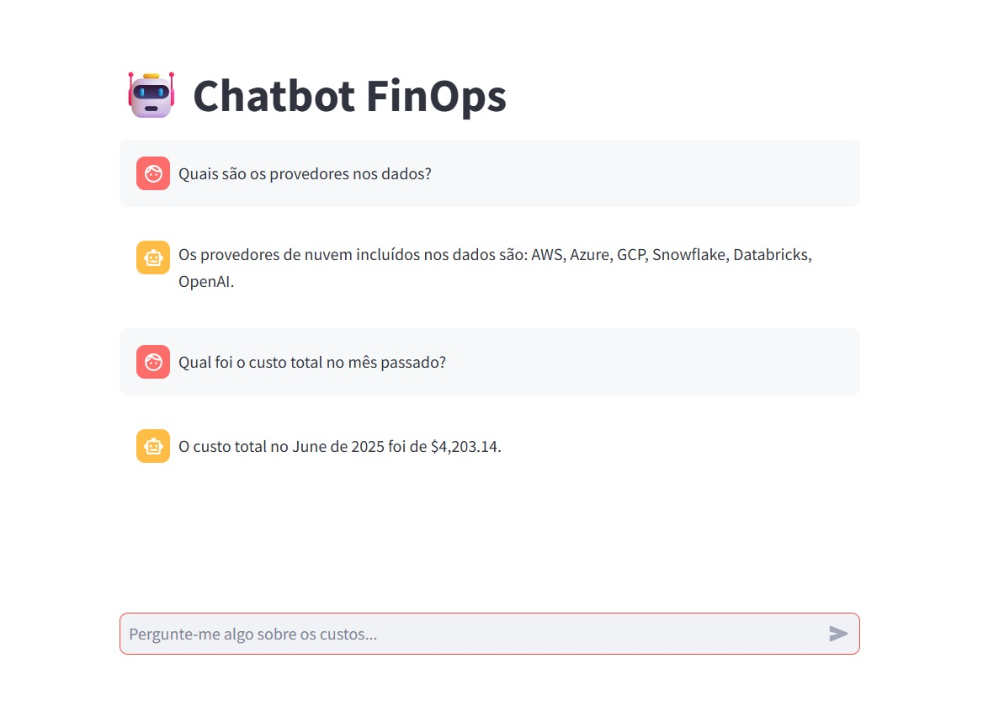
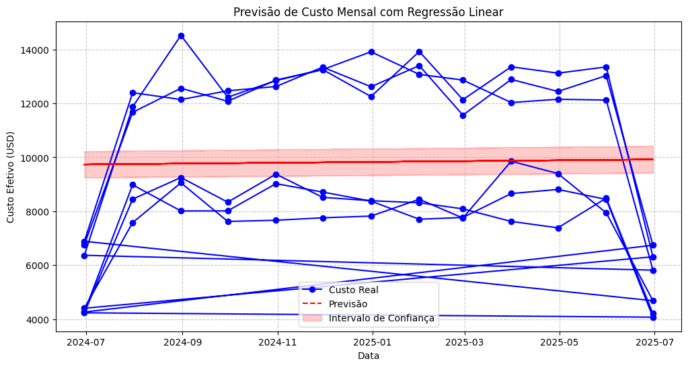
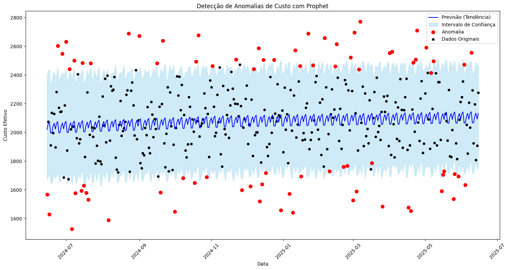
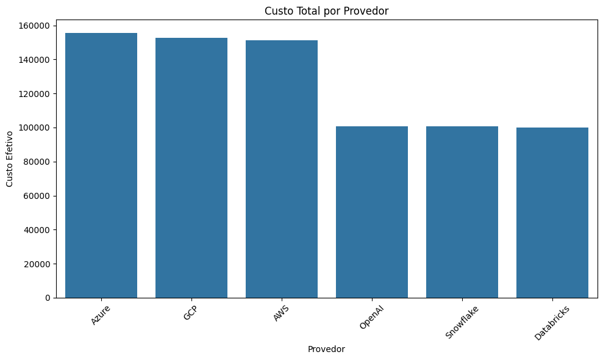
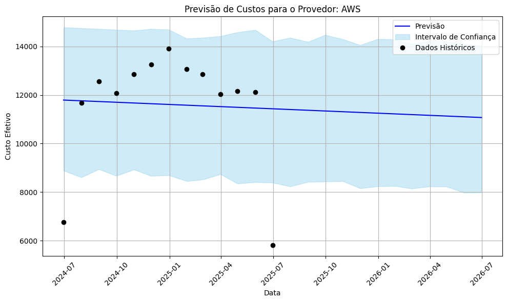
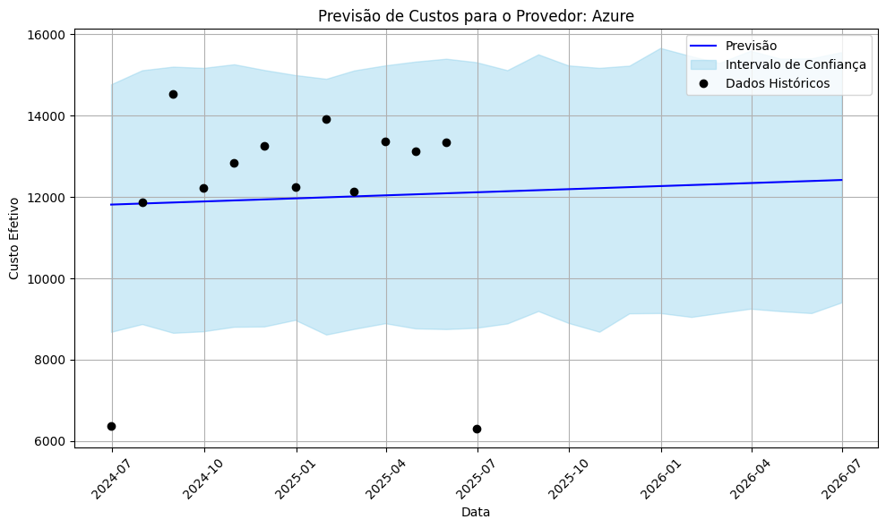
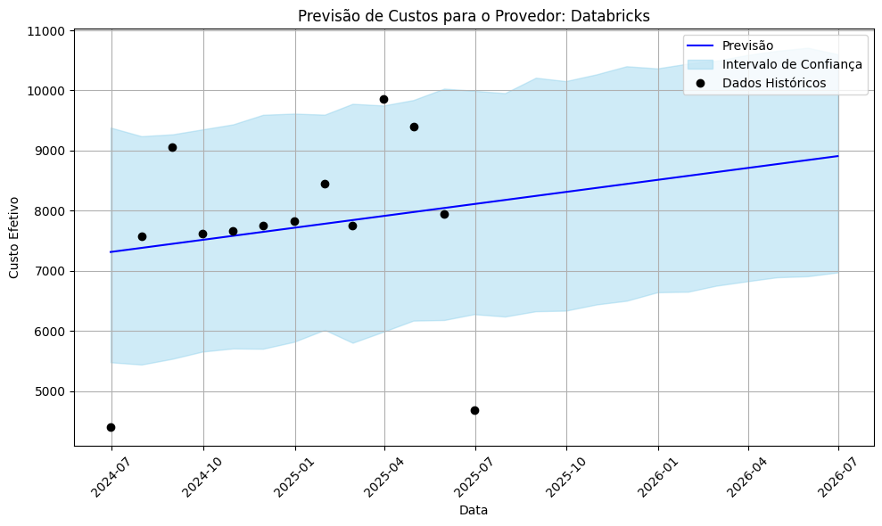
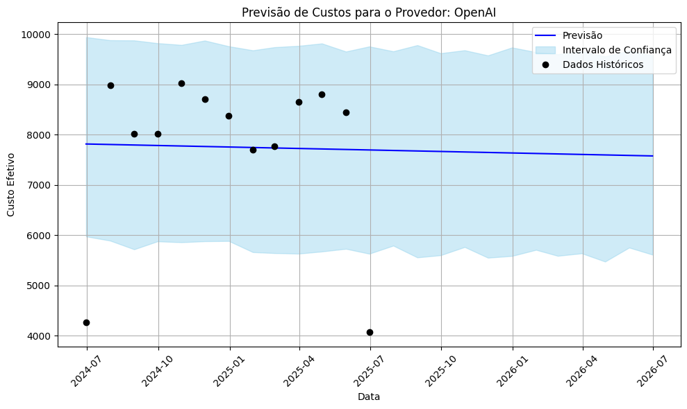
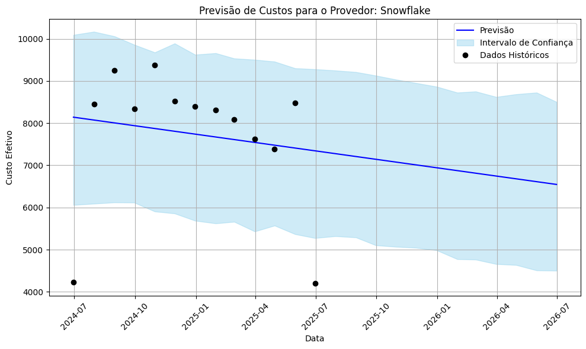
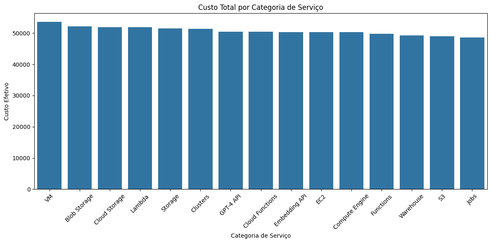

# 💬 Projeto FinOps com IA: Chatbot de Previsão e Análise de Custos

Este projeto demonstra a aplicação de Machine Learning e Inteligência Artificial para resolver problemas reais de gestão financeira em ambientes de nuvem (FinOps). O foco é construir uma solução interativa capaz de analisar dados de custos, fornecer insights e prever gastos futuros — tudo através de um chatbot intuitivo.

---

## 🎯 Objetivo

Criar um chatbot inteligente, apelidado de **FinOps Copilot**, que atua como um assistente virtual para analistas e gestores, respondendo a perguntas complexas sobre os custos de nuvem de forma rápida e eficiente.

---

## 🚀 Funcionalidades Atuais

- **Análise de Dados Interativa**  
  O chatbot responde a perguntas específicas sobre o dataset de custos, como a lista de provedores e o custo total do último mês.

- **Integração com IA**  
  Utiliza a API da OpenAI para entender perguntas em linguagem natural, indo além de uma simples busca por palavras-chave.

- **Previsão de Custos**  
  Utiliza o modelo Prophet para gerar previsões mensais e fornece um resumo textual sobre a projeção.

- **Dashboard de Previsão**  
  Gráficos gerados com Matplotlib e Prophet para visualização clara das tendências.

- **Interface do Chatbot**  
  Desenvolvida com Streamlit, permite interação direta com o modelo de IA.

---

## 🖼️ Exemplos de Visualizações

### 💬 Interface do Chatbot


### 📈 Previsão de Custos


### 🔍 Detecção de Anomalias


### 📊 Custo Total por Provedor
Visualizações detalhadas do custo total por provedor de nuvem:

- **Geral**
  

- **AWS**
  

- **Azure**
  

- **GCP**
  

- **Databricks**
  

- **OpenIA**
  

- **Snowflake**
  

### 🧮 Custo Total por Serviço


---

## 🛠️ Ferramentas e Tecnologias

- **Python 3.11** – Linguagem principal  
- **Streamlit** – Interface web interativa  
- **Pandas** – Manipulação de dados  
- **OpenAI API** – Processamento de linguagem natural  
- **Prophet (Meta)** – Previsão de séries temporais  
- **Matplotlib / Seaborn** – Visualização de dados  
- **VS Code** – Ambiente de desenvolvimento

---

## 📂 Estrutura do Projeto


. ├── .venv/                         # Ambiente virtual do Python ├── data/ │   ├── processed/ │   └── raw/ ├── notebooks/                     # Notebooks com o desenvolvimento e testes ├── src/ │   ├── init.py                # Marca o diretório como pacote Python │   ├── chatbot_logic.py           # Lógica principal do chatbot │   └── cost_forecasting.py        # Módulo de previsão de custos ├── docs/                          # Imagens e gráficos gerados ├── .env                           # Variáveis de ambiente (ex: chave da API) ├── .gitignore                     # Arquivos ignorados pelo Git ├── app.py                         # Aplicação Streamlit ├── requirements.txt               # Lista de dependências └── README.md                      # Este arquivo

---

## ⚙️ Como Executar

1. **Clone o repositório**
   ```bash
   git clone https://github.com/izadorasobral/focus-cost-forecast-ia.git
   cd focus-cost-forecast-ia


- Ative o ambiente virtual
.venv\Scripts\activate
- Instale as dependências
pip install -r requirements.txt


- Execute o Streamlit
streamlit run app.py


O Streamlit abrirá uma nova aba no seu navegador com o chatbot em funcionamento.

🗺️ Próximos Passos
- Detecção de Anomalias
Implementar a lógica do notebook 03_anomaly_detection.ipynb para identificar picos de custo inesperados.
- Integração com Alertas
Conectar a detecção de anomalias a sistemas como Slack ou e-mail.
- Análise de Variação de Custos
Permitir que o chatbot explique por que um custo subiu ou caiu em determinado período.
- Visualizações Dinâmicas
Exibir gráficos diretamente na interface do chatbot com Matplotlib ou Plotly.

👩‍💻 Autora
Izadora Sobral
LinkedIn • GitHub

📄 Licença
Este projeto está sob a licença MIT. Veja o arquivo LICENSE para mais detalhes.
